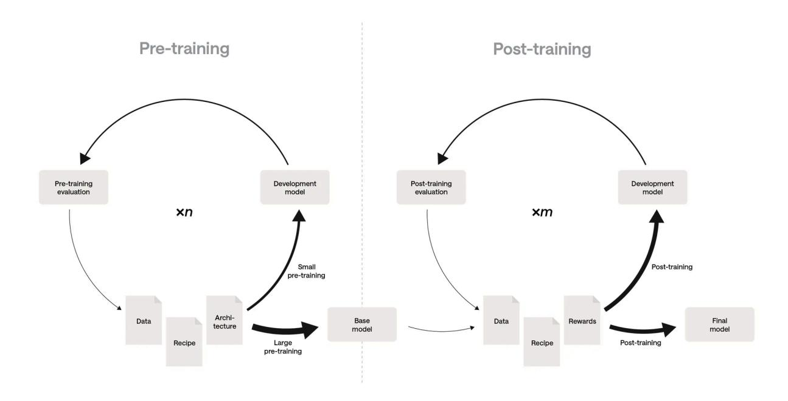
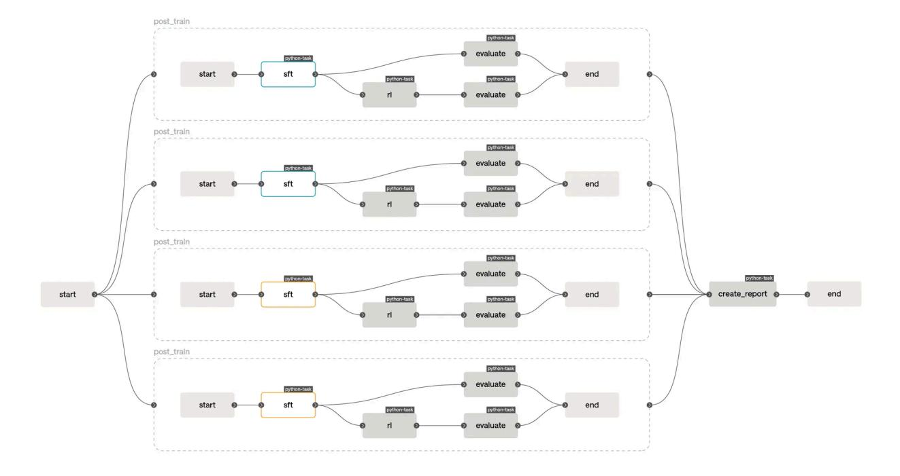
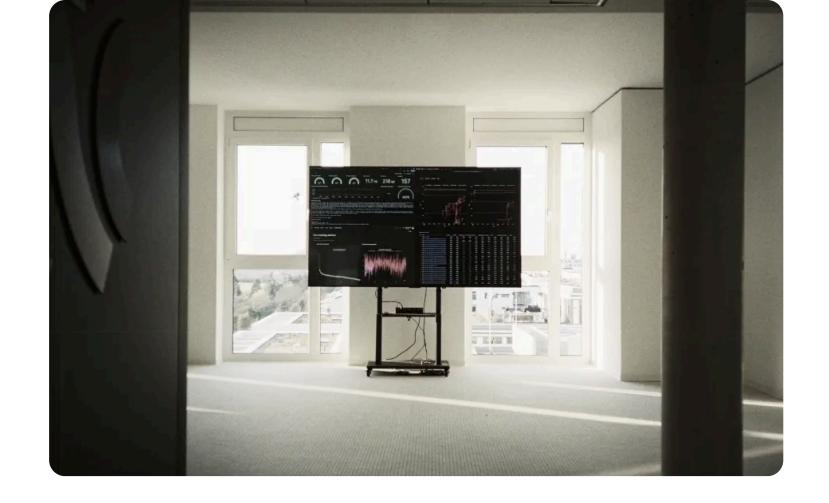

Research

# Model Training as Code

Michael Barlow 22/05/2026

> TL;DR: Model training has grown complex enough to require many specialised stages and teams, and manual coordination between them doesn't scale. At Aleph Alpha, we've built Savanna, a model factory that implements the entire training pipeline in code, turning model training into a collaborative software project. In Savanna, end-to-end training runs are hermetic, and launchable with one click. This post describes Savanna, why it's needed, and the engineering culture that makes it effective.

### Introduction

Model training is moving fast. New stages keep joining the pipeline and existing ones grow more intricate, making model training an engineering challenge forthree key reasons. First, more complexity means more room for error: bugs or inconsistencies in data, code, or configuration can cause entire training runs to fail or diverge. Second, the cost of failure keeps rising: models grow larger, GPU prices rise, and ever more data is processed per run. When you're burning thousands of GPU hours, "oops" is an expensive word.

The third and hardest challenge is organisational. The complexity has long outgrown the capacity of a single mind, so labs like ours have built large, specialised teams. The problem then becomes coordinating those teams. How can members autonomously explore the latest research in their area of expertise, while integrating their changes into the production pipeline without breaking it or interfering with each other's work? And how do they ensure that improvements to individual stages translate into a better model at the end?

Traditional, manual model training processes do not have good answers to these questions.

## The hidden cost of manual model training

Let's break down the traditional manual process. At a high level, model training looks simple: pre-training to absorb the internet, followed by post-training to learn instructionfollowing. In reality, you don't train a good model on your first try. Arriving at a good data mix, architecture and training recipe is an iterative, compute-bound process guided by evaluation, where each arrow below is weighted by its relative GPU cost:



Each of these components is complex enough to warrant multiple dedicated teams. Modern post-training, for example, comprises a supervised fine-tuning (SFT) stage followed by a reinforcement learning (RL) stage. SFT and RL require different skillsets and tools, but must be integrated to train a model.

Consider what a single model's journey through the pipeline might look like in a manual lab:

The data team finishes a new mix and sends the database path over Slack to the pretraining team, who kick off a multi-week run. Two weeks in, the storage quota fills up and

the training run crashes. The filesystem is managed manually, so no one is sure whether it's safe to delete that 30TB dataset with do\_not\_delete in its file name, and the GPUs sit idle while the pre-training team works this out. When they finally relaunch, they reconstruct the original setup from memory and Slack threads, hoping they didn't forget to set a flag. This is the first hidden cost: every manual step is an opportunity for human error.

When pre-training is eventually complete, the pre-training team hands the checkpoint to the SFT team. To find a good recipe, the SFT team then manually kicks off a sweep of parallel trainings with different configurations and data mixes. As checkpoints roll in, the team runs their evaluation script on each one, sharing results and analysis in Slack. Some recipes look promising, others don't, and they repeat this process for a few weeks until they narrow down a good one. Without realising it, the team repeated some experiments that they already completed forthe previous pretrained checkpoint a few months back.

This is the second hidden cost: the team forgets its learnings. There's no durable record of the reasoning behind a hyperparameter's current value, no formal link between a data mix and its constituent datasets, and no clear attribution attaching a model to the training recipe that produced it. In a manual lab, this lineage is scattered across Slack, the filesystem, an experiment manager and various wiki pages, and is easily lost overtime.

The SFT team hands their checkpoint to the RL team, who kick off a training run with this as the base. The final model underperforms. Is the RL recipe overfit to last month's SFT checkpoint, or is the SFT checkpoint itself at fault? Aftertwo weeks of debugging, the RL team confirms it's the latter. Neitherteam can execute the other's stage, so each had optimised for its own slice of the pipeline ratherthan the model at the end. And because integration is a manual hand-off, it happens rarely, leaving a month's worth of divergence to reconcile each time. This is the third hidden cost: manual, infrequent handoffs fragment teams' ownership.

It's clearthat manual model training doesn't scale, and automation is not the only missing piece. Each of these hidden costs stem from the same underlying problem: the pipeline lives in the minds of the team ratherthan in a shared, durable artefact. To scale, the pipeline itself needs to be something tractable that teams can collaborate on.

## Introducing: Model Training as Code

Our model factory, codenamed Savanna, implements our entire model training pipeline and processes in imperative code. We call this Model Training as Code (MTaC). Here's what a simple Savanna post-training pipeline looks like in pseudocode:

```
async post_train(config: PostTrainConfig) -> PostT
sft_checkpoint = await sft(config.sft)
sft_eval = spawn evaluate(config.eval, sft_che
rl_checkpoint = await rl(config.rl, sft_checkp
rl_eval = spawn evaluate(config.eval, rl_check
return PostTrainEvaluation(await sft_eval, awa
```

By lifting the pipeline into code, you gain three things: composability, consensus and provenance.

- 1. Composability: Composability comes from expressing manual steps as functions with typed inputs and outputs, which you can then build abstractions around and compose into an end-to-end pipeline that runs with one click. Modifying the pipeline becomes as simple as editing a function, repetitive work like evaluating intermediate checkpoints can be automated with a for loop, and testing is straightforward, because you can run subsets or downscaled versions of the pipeline with a different parametrisation.
- 2. Consensus: Consensus comes from version control. The main branch represents the team's collective best understanding of how to train a model. The code contains the full training recipe, so there is no setup to reconstruct or flag to forget when launching a training run.
- 3. Provenance: Provenance comes from code comments and commit history. These encode the learnings and decisions that led to main. Past training runs stay

reproducible, as the code that produced them is pinned in a commit you can check out and rerun.

When any team can launch the full pipeline themselves, they can run any otherteam's stage and iterate on the model as a whole ratherthan just their own slice of it. Labs typically decompose model training temporally when they scale, with each team owning a stage of the pipeline. MTaC opens the doorto a capability-based decomposition, where teams instead own a model behaviour like multilinguality from end to end.

#### Integrate little, integrate often

With the pipeline in code, standard code collaboration best practices apply, and to make the most of MTaC, you need to follow them. The most important of these is trunkbased development, where changes land on main as soon as they can and in small increments, so teams can build on each other's work at the earliest opportunity and fail fast if an approach is wrong. If you instead accumulate changes in long-lived branches, you pay the same integration debt as before.

### Using Savanna

Savanna lives in GitHub, where its CI is the entrypoint for model training. You can triggerthis CI by pushing to a branch, or by manually launching a run from the GitHub UI. Training our best model is as simple as triggering CI on main. We also use CI on pull requests to quickly validate the pipeline with a small-scale end-to-end training run. This


completes in under 5 minutes, so contributing to Savanna neverfeels slow, and it gives us confidence in our changes. To catch semantic regressions in our pipeline, we run a larger-scale end-to-end training test run every night, which validates ourtraining logic by asserting that the resulting model achieves a measurable improvement on our evaluation suite.

MTaC provides decision lineage via git blame, and Savanna extends this with artefact lineage. Runs are hermetic, and all non-code artefacts (e.g. data, models and tokenisers) are immutable and versioned in a registry, so you can be sure you're getting the same thing every time. When you kick off a run, the referenced artefacts, training logs, metrics and evaluation results are all linked to that run and the resulting checkpoint, so you can easily attribute output to input. To determine which models were trained on a specific dataset, you use the artefact lineage graph, not Slack search.

> Savanna makes full-scale runs easy, but evolving what those runs look like requires the ability to experimentally modify every aspect of the pipeline, be that data, hyperparameters, pipeline steps, environments, sharding topologies, or anything else, at a smaller scale. In Savanna, experimenting is as simple as pushing changes to a branch and running CI from there. If you want to try a new dataset, you can add it to the ablation training config and run CI. If the resulting evals show an improvement, you can then merge this change into main to make it part of the next full-scale run.

Hyperparameter sweeps are also easy. Since the pipeline is just a function, you can programmatically invoke it multiple times with different parameterisations. For example, below is an experiment to find which SFT and RL learning rates work best in the posttraining pipeline shown previously:

```
async post_training_learning_rate_experiment(confi
post_train_runs = []
for sft_learning_rate in (1e-4, 1e-5):
for rl_learning_rate in (1e-4, 1e-5):
run_config = config
.with_sft_learning_rate(sft_learni
.with_rl_learning_rate(rl_learning
post_train_runs.append(spawn post_trai
post_train_evaluations = gather post_train_run
experiment_report_url = create_report(post_tra
return experiment_report_url
```

Savanna will then orchestrate the sweep and collate the end results into a report for you to analyse. Here's this experiment visualised in Savanna's workflow engine UI:



Blue nodes are "running" and orange nodes are "awaiting cache". Although we call post\_train fourtimes, the SFT stage will only run twice: Savanna's workflow engine recognises when stages have the same inputs and will read their outputs from the cache when the corresponding running stage completes. This lets you launch sweeps that modify multiple aspects of the pipeline without worrying about the combinatorial explosion of redundant computation.

For pre-training runs or long-running RL jobs, we incrementally emit and evaluate checkpoints so we can better understand how our model changes throughout training. Aftertraining, Savanna automatically evaluates the model on our benchmark suite, and collects all results and metrics into a run report. Savanna also automatically updates our model leaderboard, which we display on a big screen in our Heidelberg HQ so everyone shares the excitement when we train our new best model.



### How Savanna works

When you trigger a run, Savanna launches a job on Flyte, our workflow engine of choice, which runs in Kubernetes. Flyte provides a convenient way to run arbitrary tasks, durable execution, sequencing, parallelism, retries, caching and a UI to visualise runs.

We store model and data artefacts immutably in our on-prem object store and track their versions in Weights & Biases. This lets us easily assign cleanup policies to keep our storage system tidy and gives us a UI to explore artefact lineage interactively. We then stream this data to our Kubernetes GPU clusters for training. During training, our jobs log metrics to our monitoring system so we can track progress and performance in real time, and send alerts if intervention is necessary.

## How has Savanna actually helped us?

We know that the complexity of model training will only grow as the field advances, and the organisational challenges will grow with it. MTaC has enabled us to lift this organisational complexity into code, which has fundamentally changed the way we work.

Day to day, we iterate faster. Most of our work is small-scale experiments and sweeps, and Savanna automates the manual launching and evaluation these used to involve. That effort now goes into analysing results and designing the next experiment.

The stakes are different for a single large run. During our most recent large pre-training run we resumed training several times to tune our setup as we learned more about how the model was behaving through our automated intermediate evals. Each relaunch was quick and low-risk, because the consensus MTaC provided meant there was no setup to reconstruct and no flag to forget. And because relaunching was easy, it did not need to be the same person twice, so whoever was on hand could safely pick it up.

At a higher level, MTaC has allowed us to set up multiple capability-oriented post-training teams who own the integration and improvement of a model behaviour end-toend. Our multilinguality team, for example, is making the model excel at German language and culture by building the SFT datasets, RL environments and evaluation suites this requires.

Since adopting Savanna and embracing engineering culture, our learning rate as an organisation has significantly increased, and the approach has only become more valuable as our pipeline has grown deeper and our teams larger.

Looking further ahead, we see MTaC as a key enablerfor auto-research. With our entire pipeline in code, an LLM agent can read, modify and run it autonomously, and we are beginning to explore this now. One day, we hope our model will be able to self-improve via Savanna.

#### Acknowledgments

Written by Michael Barlow. This work reflects the collective efforts of many contributors across Aleph Alpha Research who brought Savanna to life. Thanks to Martin Reinhardt, Dominik Kellner and Jordan Sassoon for helpful feedback that shaped this blog, and Paige Reddington and Noé Beckerle Vallejo for making it presentable.


| Contact                                         | Legal                        | Social        | Enquiries          |
|-------------------------------------------------|------------------------------|---------------|--------------------|
| Speyerer<br>Straße<br>14<br>Heidelberg<br>69115 | Privacy<br>Policy<br>Imprint | LinkedIn<br>X | Contact<br>Support |
| Wallstraße<br>16<br>Berlin<br>10179             |                              | GitHub        | Career             |
| Weiherstraße<br>26<br>Bayreuth<br>95448         |                              |               |                    |
| Einsteinstraße<br>174<br>München<br>81677       |                              |               |                    |

Copyright © 2026 Aleph Alpha GmbH